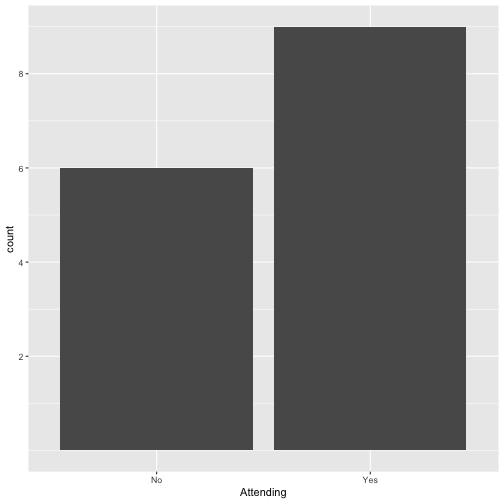

```r
library(ggplot2)
library(knitr)

# Switch off showing code...
knitr::opts_chunk$set(echo=FALSE)

# Function to to column of data where each entry can have 
# more than one piece of text separated by a comma
# and return a vector with all the terms
collectTerms <- function(entries){
  unlist(strsplit(entries,"[,]")) -> r
  
  # Strings may have a leading space which we'll remove
  roles <- sapply(r,function(s){
    l <- unlist(strsplit(s,"^ "))
    if ( length(l) == 1 ){
      return(l)
    }
    else{
      return(l[length(l)])
    }
  })
  return(as.vector(roles))
}


# Function to remove blank entries from a column
# and then print them out nicely
printComments <- function(entries){
  r <- sapply(entries,function(e){
    if ( e == ""){
      NULL
    }
    else { e }
 })
  kable(as.vector(unlist(r)))
}

# Convert columns of data on individual themes and recast it
# as a single vector
turnIntoOneColumn <- function(data,cols){
  colNames <- names(data)[cols]
  nRows <- dim(data)[1]
  labels <- rep(colNames,each=nRows)
  results <- c()
  for ( label in colNames ){
    results <- c(results,data[,label])
  }
  return(data.frame(theme=labels,score=results))
}

# Remove rows where the theme scores have zero variance
removeZeroVarRows <- function(data,cols){
  nRows <- dim(data)[1]
  keep <- c()
  for ( i in 1:nRows ){
    if (var(as.numeric(data[i,cols])) > 1e-6){
      keep <- c(keep,i)
    }
  }
  return(data[keep,])
}

survey <- read.csv("Questionnaire.csv",stringsAsFactors=FALSE)

ggplot(data=survey,aes(x=Attending)) + geom_bar() + scale_y_continuous(breaks=c(2,4,6,8,10))
```



```r
ggplot(data=survey,aes(x=Organisation)) + geom_bar() + scale_y_continuous(breaks=c(2,4,6,8,10))
```


```r
x <- data.frame(roles=collectTerms(survey$Role))
ggplot(data=x,aes(x=roles)) + geom_histogram(stat="count") + theme(axis.text.x = element_text(angle = 90, hjust = 1))
```

```
## Warning: Ignoring unknown parameters: binwidth, bins, pad
```


```r
printComments(survey$OtherRoles)
```


|x                                                                                                                                                                                                                                                                                                |
|:------------------------------------------------------------------------------------------------------------------------------------------------------------------------------------------------------------------------------------------------------------------------------------------------|
|Research Data Specialist in the research support unit of university library (including teaching and training activities, policy development, infrastructure support)                                                                                                                             |
|I am part of the research data support team at the library in my institution. My role involves planning and coordinating RDM training, planning and coordination the efforts around software source code management and I am also part of the front-office of our institutional data repository. |
|I am a scientific training officer in the training team at EMBL-EBI. My role involves organising, co-ordinating and running both face-to-face and online courses.                                                                                                                                |
|I help to describe the needs of the community                                                                                                                                                                                                                                                    |

```r
x <- data.frame(ResearchDomains=collectTerms(survey$ResearchDomain))
ggplot(data=x,aes(x=ResearchDomains)) + geom_histogram(stat="count") + theme(axis.text.x = element_text(angle = 90, hjust = 1))
```

```
## Warning: Ignoring unknown parameters: binwidth, bins, pad
```


```r
printComments(survey$OtherResearchDomain)
```


|x                                                                                                                                                  |
|:--------------------------------------------------------------------------------------------------------------------------------------------------|
|Library & Information Science                                                                                                                      |
|Information management                                                                                                                             |
|Interdisciplinary: Art x Social Science x Information Science                                                                                      |
|Leiden University is a broad university with seven faculties and I am supporting them all in my role as expert in data management and open access. |
|I wokr on the meta level                                                                                                                           |

```r
ggplot(data=survey,aes(x=CourseMaterialsSearch)) + geom_bar() + scale_y_continuous(breaks=c(4,8,12,16,20)) + theme(axis.text.x = element_text(angle = 45, hjust = 1))
```


```r
printComments(survey$CourseMaterialsSearchReasonNo)
```


|x                                                                                                                                                                                                                                                                         |
|:-------------------------------------------------------------------------------------------------------------------------------------------------------------------------------------------------------------------------------------------------------------------------|
|Yes I want this implemented in TeSS                                                                                                                                                                                                                                       |
|If this scenario is for researchers, they are more likely to use search, a dynamic search based on the terms they are entering similar to https://vocabs.ands.org.au/vocabs/page/widget_explorer. If searching is not successful, then yes, this is a reasonable example. |
|Challenge is the choice of terminology structuring; in this case I would suggest using a thesaurus since that organises knowledge for subsequent retrieval in a hierarchical way (given the mentioning of child/parent terms).                                            |

```r
ggplot(data=survey,aes(x=FAIRJobAssessment)) + geom_bar() + scale_y_continuous(breaks=c(4,8,12,16,20)) + theme(axis.text.x = element_text(angle = 45, hjust = 1))
```


```r
ggplot(data=survey,aes(x=ArticleQualityControl)) + geom_bar() + scale_y_continuous(breaks=c(4,8,12,16,20)) + theme(axis.text.x = element_text(angle = 45, hjust = 1))
```


```r
ggplot(data=survey,aes(x=DataRepositoryUploaderSkillsCheck)) + geom_bar() + scale_y_continuous(breaks=c(4,8,12,16,20)) + theme(axis.text.x = element_text(angle = 45, hjust = 1))
```


```r
printComments(survey$ReasonsNo)
```


|x                                                                                                                                                                                                                                                                                                                                                                                                                                                                                                                                                                                                                                                                                                                                                                                                                                                                                                                                                                                                                                                                                                                                                                                                                                                                                                                                                                                                                                                                                                                                                                                                                                                                                                                                                                                                                                                                                                                                                                                                                  |
|:------------------------------------------------------------------------------------------------------------------------------------------------------------------------------------------------------------------------------------------------------------------------------------------------------------------------------------------------------------------------------------------------------------------------------------------------------------------------------------------------------------------------------------------------------------------------------------------------------------------------------------------------------------------------------------------------------------------------------------------------------------------------------------------------------------------------------------------------------------------------------------------------------------------------------------------------------------------------------------------------------------------------------------------------------------------------------------------------------------------------------------------------------------------------------------------------------------------------------------------------------------------------------------------------------------------------------------------------------------------------------------------------------------------------------------------------------------------------------------------------------------------------------------------------------------------------------------------------------------------------------------------------------------------------------------------------------------------------------------------------------------------------------------------------------------------------------------------------------------------------------------------------------------------------------------------------------------------------------------------------------------------|
|I don't see the connection between the skills of the data repository managers and the quality of their submitted data sets                                                                                                                                                                                                                                                                                                                                                                                                                                                                                                                                                                                                                                                                                                                                                                                                                                                                                                                                                                                                                                                                                                                                                                                                                                                                                                                                                                                                                                                                                                                                                                                                                                                                                                                                                                                                                                                                                         |
|Is this aligned with CASRAI CRediT? Seems more appropriate for determining roles re: data sets. Otherwise, I can't see data repository managers doing this often in the current state of things.                                                                                                                                                                                                                                                                                                                                                                                                                                                                                                                                                                                                                                                                                                                                                                                                                                                                                                                                                                                                                                                                                                                                                                                                                                                                                                                                                                                                                                                                                                                                                                                                                                                                                                                                                                                                                   |
|Perhaps I am being picky but I don't understand why the quality control on uploaded datasets is done on the users rather the datasets themselves. I think it is reasonable to use the terminology to assess the users' knowledge of the FAIR principles and their applications and training needs. Whether they will answer the survey, that is a different story.                                                                                                                                                                                                                                                                                                                                                                                                                                                                                                                                                                                                                                                                                                                                                                                                                                                                                                                                                                                                                                                                                                                                                                                                                                                                                                                                                                                                                                                                                                                                                                                                                                                 |
|I'd rather implement the terminology into the repository (e.g. uploaders choose contributor and data curation processes roles according to the terminology)                                                                                                                                                                                                                                                                                                                                                                                                                                                                                                                                                                                                                                                                                                                                                                                                                                                                                                                                                                                                                                                                                                                                                                                                                                                                                                                                                                                                                                                                                                                                                                                                                                                                                                                                                                                                                                                        |
|Added value of the terminology in these types of use cases is dubious, since it will not likely be able to replace or even meaningfully complement qualitative evaluation by humans (or even A.I.).                                                                                                                                                                                                                                                                                                                                                                                                                                                                                                                                                                                                                                                                                                                                                                                                                                                                                                                                                                                                                                                                                                                                                                                                                                                                                                                                                                                                                                                                                                                                                                                                                                                                                                                                                                                                                |
|The terminology could potentially be used to survey required skills for repository uploader. However more conditions/explanations need to be added in this use case, e.g. the consent from data onwer for being contacted and participating the survey.                                                                                                                                                                                                                                                                                                                                                                                                                                                                                                                                                                                                                                                                                                                                                                                                                                                                                                                                                                                                                                                                                                                                                                                                                                                                                                                                                                                                                                                                                                                                                                                                                                                                                                                                                            |
|A quality control on uploaded data sets should be inspected directly looking at the data sets.Although it is an interesting proposal to use the terminology to inspect the gaps in training at an institution, I would not implemented in relation to a data repository. Skills check could perhaps be implemented/used by graduate schools or education departments.                                                                                                                                                                                                                                                                                                                                                                                                                                                                                                                                                                                                                                                                                                                                                                                                                                                                                                                                                                                                                                                                                                                                                                                                                                                                                                                                                                                                                                                                                                                                                                                                                                              |
|                                                                                                                                                                                                                                                                                                                                                                                                                                                                                                                                                                                                                                                                                                                                                                                                                                                                                                                                                                                                                                                                                                                                                                                                                                                                                                                                                                                                                                                                                                                                                                                                                                                                                                                                                                                                                                                                                                                                                                                                                   |
|The gap analysis is too implicit. I guess what is meant is that if they have not used skills from the framework it means that they need training on these skills? It would be useful if there would be an easy mechanism for them to also add other skills they have used that we might have missed.                                                                                                                                                                                                                                                                                                                                                                                                                                                                                                                                                                                                                                                                                                                                                                                                                                                                                                                                                                                                                                                                                                                                                                                                                                                                                                                                                                                                                                                                                                                                                                                                                                                                                                               |
|For the FAIR - related job assessment case: limited. Difficulty I feel here is that the use of the terminology might be righteous, but to what extent can we select the best candidate using it? The assumption is that the more the cv contains terms from the terminology, the better the candidate. I would say that the use case is a reasonable example in the case the given suggestions were then to be judged by humans. The situation might occur that an applicant uses a lot of detailed terms, as "cv filling", but knows only the basics, let's call that a false positive. Best structuring would be an ontology, given the relations between different entities within the field. And on a more general level: if an applicant were to apply for a job in this field, are we not automatically within the domain of the FAIR4S terminology? Is this automated job application assessment therefore necessary?

For the Article quality control case: I feel like there are some steps missing. For example: how can we determine the article's quality, given only the used terms for FAIR-related competencies? This has to do with the validity of the tool, i.e. is it measuring the paper's quality, or the overlap the paper shows with the terminology. One is not inherent to the other, i think. My feeling is that in this case, the terminology would have only quantitative impact (i.e.: how many FAIR-related papers have we published) over qualitative content (i.e. how FAIR are our datasets? The step between these two is human-centered; a professional in the field has to judge whether or not quality pursued is obtained. Case 2 and 3 are equivalent in this sense.

For the data repository uploader skill check: absolutely a significant use case, depicting well the interchangeable concept of 'quality': we would always need human judgement. The use of the terminology in this case can support the enhancement of professional skills within the FAIR-framework. |
|Job assessment: from experience I can say that people use all kind of different terminology to explain what they have done, depending on their background:  community, country, domain etc. Using a terminology this way will enhance biases.

Article quality control: a less certain NO from me than with the CV case but this will only work if people have to fill in templates about their data handling ifyou ask me                                                                                                                                                                                                                                                                                                                                                                                                                                                                                                                                                                                                                                                                                                                                                                                                                                                                                                                                                                                                                                                                                                                                                                                                                                                                                                                                                                                                                                                                                                                                                                                         |

```r
ggplot(data=survey,aes(x=CurriculumDesign)) + geom_bar() + scale_y_continuous(breaks=c(4,8,12,16,20)) + theme(axis.text.x = element_text(angle = 45, hjust = 1))
```


```r
printComments(survey$CurriculumDesignReasonsNo)
```


|x                                                                                                                                                                                                                                                                                                                                                                                                                                          |
|:------------------------------------------------------------------------------------------------------------------------------------------------------------------------------------------------------------------------------------------------------------------------------------------------------------------------------------------------------------------------------------------------------------------------------------------|
|I am not sure that the only need/purpose here is an automated scanning of training materials to do the match with the terms in the taxonomy. I think that manual mapping (in both directions )  is also very valid . Trainers can easily map their courses to the taxonomy (in my ideal world)                                                                                                                                             |
|Maybe. I could use this as a filter to select appropriate texts but I would still need to review the hits to assess the quality/depth of the material. The appearance of terms in a text doesn't guarantee coverage of these topics. I would also find competencies useful when deciding what should go into a course. This would be particularly helpful for new trainers who have not had to deliver training on this topic in the past. |
|Input: like case 4, the human aspect is important. The FAIR-terminology and -competency framework support a human decision-making process.                                                                                                                                                                                                                                                                                                 |
|It will work best if the instructor skills list is aligned with the FAIR Competency framework using a common form.                                                                                                                                                                                                                                                                                                                         |
|This can be a helpful first step to weed out texts that are not what you are looking for, but it can not be the only step to find relevant texts.                                                                                                                                                                                                                                                                                          |

```r
printComments(survey$OtherUseCases)
```


|x                                                                                                                                                                                                                                                                                                                                                                                                                                                                                                                                                                                                                                                                                                                                                                                                                                                                                                                                                                                                                                                                                                                                                                                                          |
|:----------------------------------------------------------------------------------------------------------------------------------------------------------------------------------------------------------------------------------------------------------------------------------------------------------------------------------------------------------------------------------------------------------------------------------------------------------------------------------------------------------------------------------------------------------------------------------------------------------------------------------------------------------------------------------------------------------------------------------------------------------------------------------------------------------------------------------------------------------------------------------------------------------------------------------------------------------------------------------------------------------------------------------------------------------------------------------------------------------------------------------------------------------------------------------------------------------|
|Linked to the Jobs:  To use it to build a function profile in the function house of an organisation (e.g. the NFU, Netherlands Fededration of University Medical Hospitals)
Also Linked to the Jobs:  Use it to scan job advertisements and/or design job advertisements                                                                                                                                                                                                                                                                                                                                                                                                                                                                                                                                                                                                                                                                                                                                                                                                                                                                                                                                   |
|A research software example is not included (or maybe one of the data-related examples above can include software). An example of determining an author's FAIR (competency) profile, so scanning their research listed on ORCID as one example.                                                                                                                                                                                                                                                                                                                                                                                                                                                                                                                                                                                                                                                                                                                                                                                                                                                                                                                                                            |
|Perhaps it could also be used by policy makers when formulating RDM policies, whether at funding agencies or at research institutions. The terminology could be used to match policy requirements with skills and competencies needed to fulfill those requirements.                                                                                                                                                                                                                                                                                                                                                                                                                                                                                                                                                                                                                                                                                                                                                                                                                                                                                                                                       |
|I could not add comments to the question about "FAIR-related job description assessment", so I'll do that here: I see that more on a qualitative level - employers should use the catalogue to write job ads and evaluate applicants.                                                                                                                                                                                                                                                                                                                                                                                                                                                                                                                                                                                                                                                                                                                                                                                                                                                                                                                                                                      |
|The terms could be used as tags, or in the context of data management plans. These could be further elaborated in the workshop.                                                                                                                                                                                                                                                                                                                                                                                                                                                                                                                                                                                                                                                                                                                                                                                                                                                                                                                                                                                                                                                                            |
|The terminology can be used to identify and generate related job descriptions, in terms of relevant skills required and job activities. However I would not use the terms to assess CVs in an automated way, simply because wording in CVs could vary a lot on describing the same things. 

The terminology could also potentially used in making strategic or tactical institutional RDM roadmap. It can be used to assess the current status of RDM prachtices and determine the next priorities regarding institutional conditions.                                                                                                                                                                                                                                                                                                                                                                                                                                                                                                                                                                                                                                                                    |
|Software FAIR                                                                                                                                                                                                                                                                                                                                                                                                                                                                                                                                                                                                                                                                                                                                                                                                                                                                                                                                                                                                                                                                                                                                                                                              |
|There was no way to add this above so I'm adding it here instead. For the FAIR-related job application assessment: The use of terms in a CV doesn't guarantee the suitability of a candidate. This assumes that all candidates describe their skills and experience in a consistent way. --- For article quality control: Mentioning terms in an article doesn't guarantee that the steps have been taken. Similarly, researchers may not explicitly mention steps they have taken although they have been applied. I can see that this might be used to flag sections of a article that a relevant but using it to judge a paper might be a step too far.                                                                                                                                                                                                                                                                                                                                                                                                                                                                                                                                                 |
|As a librarian I will organise a workshop for researchers related to any of the subjects in the ontology. In my communication related to the workshop (blogs, twitter, LinkedIn, newsletters) I make sure that I use consistent terminology by browsing the ontology for concepts related to the topic I will present.                                                                                                                                                                                                                                                                                                                                                                                                                                                                                                                                                                                                                                                                                                                                                                                                                                                                                     |
|Case 6a: Finding FAIR and trusted digital repositories
The data-management departement of a mid-sized university would like to provide a list of preferred repositories for their researchers to deposit data. The university has a number of standards which the repositories have to fulfil. These not only cover the repositories’ trustworthiness (TDRs) but to a large extent also concern the FAIR maturity level. Using the terms within the terminology and entering them in an online repository finder tool, the data-management department finds the most suitable and mature repositories.   

Case 6b: Ensuring research output is FAIR, for TDR's 
As a leading researcher in the field of information and data sciences, I am responsible and accountable for your research areas activities and behaviour. I am aware of legal and ethical aspects of the research you conduct, including the FAIR-principles that make your and your team's outputs FAIR. My knowledge and understanding of the FAIR terminology and the FAIR4S framework enables you to fulfil the synergetic role of intermediary between research outputs on the one hand, and trusted repositories on the other hand. |

```r
x <- data.frame(ResearchDomains=collectTerms(survey$UseCasesWouldEmploy))
ggplot(data=x,aes(x=ResearchDomains)) + geom_histogram(stat="count") + theme(axis.text.x = element_text(angle = 90, hjust = 1))
```

```
## Warning: Ignoring unknown parameters: binwidth, bins, pad
```


```r
ggplot(data=survey,aes(x=TerminologySelection)) + geom_histogram(stat="count") + theme(axis.text.x = element_text(angle = 90, hjust = 1))
```

```
## Warning: Ignoring unknown parameters: binwidth, bins, pad
```


```r
printComments(survey$ExplanationTerminologySection)
```


|x                                                                                                                                                                                                                                                                                                                                                                                                                                                                                                                                          |
|:------------------------------------------------------------------------------------------------------------------------------------------------------------------------------------------------------------------------------------------------------------------------------------------------------------------------------------------------------------------------------------------------------------------------------------------------------------------------------------------------------------------------------------------|
|because I would like it to be able to show related terms, so be a bit broader that only the controlled vocabulary                                                                                                                                                                                                                                                                                                                                                                                                                          |
|I initially chose ontology since it seems that relationships between the competencies can become very rich but decided on a thesaurus as it seemed like a simpler approach to take where it is more accessible to the research community and helps with scoping the initial work (instead of maybe getting carried away with the ontology which requires more work).                                                                                                                                                                       |
|I must say I found it difficult to decide as I'm not a specialist on this type of work, but it seems to make sense to make it "accessible to computational querying and reasoning".                                                                                                                                                                                                                                                                                                                                                        |
|to keep it simple and widely applicable. I find it more important to educate people on the meaning and correct use of the terminology.                                                                                                                                                                                                                                                                                                                                                                                                     |
|Facilitates interoperability between different languages.                                                                                                                                                                                                                                                                                                                                                                                                                                                                                  |
|It is hard to select one out of the three options. They all contribute to building the FAIR competences for different purpose. Before going into details in CV or thesaurus, it is important to have a holistic overview of everything within the working scope. That's the only reason I chose ontology, but again I would not leave the other 2 aspects/components out.                                                                                                                                                                  |
|For the use cases I selected a Thesaurus seems to be the most complete, but at the same time the simplest solution from these options.                                                                                                                                                                                                                                                                                                                                                                                                     |
|Speed of development and flexibility of use.                                                                                                                                                                                                                                                                                                                                                                                                                                                                                               |
|Given the generic nature of ontologies - containing entities of a certain domain, thesauri and controlled vocabularies might become part of an ontology of FAIR terminologies. In constructing an Ontology, FAIR-terminology can also be made Linked-Web-Ready, for example when abiding to RDF-rules and semantic interoperability. This can then be linked back to the I in FAIR, for both machines and humans. This two-way-interoperability is the reason that I, in my earlier answers, emphasised the human factor in the use cases. |
|Building a formal model of the domain can become complex and cumbersome.                                                                                                                                                                                                                                                                                                                                                                                                                                                                   |
|Looking at what the use cases aim for, you do need to make sure that you don't flatten the complexity too much                                                                                                                                                                                                                                                                                                                                                                                                                             |

```r
kable(survey[which(survey$TerminologySelection=="Controlled Vocabulary"),"ExplanationTerminologySection"])
```


|x                                                                                                                                                                                   |
|:-----------------------------------------------------------------------------------------------------------------------------------------------------------------------------------|
|I must say I found it difficult to decide as I'm not a specialist on this type of work, but it seems to make sense to make it "accessible to computational querying and reasoning". |
|to keep it simple and widely applicable. I find it more important to educate people on the meaning and correct use of the terminology.                                              |
|                                                                                                                                                                                    |
|                                                                                                                                                                                    |
|                                                                                                                                                                                    |

```r
kable(survey[which(survey$TerminologySelection=="Thesaurus"),"ExplanationTerminologySection"])
```


|x                                                                                                                                                                                                                                                                                                                                                                    |
|:--------------------------------------------------------------------------------------------------------------------------------------------------------------------------------------------------------------------------------------------------------------------------------------------------------------------------------------------------------------------|
|because I would like it to be able to show related terms, so be a bit broader that only the controlled vocabulary                                                                                                                                                                                                                                                    |
|I initially chose ontology since it seems that relationships between the competencies can become very rich but decided on a thesaurus as it seemed like a simpler approach to take where it is more accessible to the research community and helps with scoping the initial work (instead of maybe getting carried away with the ontology which requires more work). |
|For the use cases I selected a Thesaurus seems to be the most complete, but at the same time the simplest solution from these options.                                                                                                                                                                                                                               |
|                                                                                                                                                                                                                                                                                                                                                                     |
|Speed of development and flexibility of use.                                                                                                                                                                                                                                                                                                                         |
|Building a formal model of the domain can become complex and cumbersome.                                                                                                                                                                                                                                                                                             |

```r
kable(survey[which(survey$TerminologySelection=="Ontology"),"ExplanationTerminologySection"])
```


|x                                                                                                                                                                                                                                                                                                                                                                                                                                                                                                                                          |
|:------------------------------------------------------------------------------------------------------------------------------------------------------------------------------------------------------------------------------------------------------------------------------------------------------------------------------------------------------------------------------------------------------------------------------------------------------------------------------------------------------------------------------------------|
|Facilitates interoperability between different languages.                                                                                                                                                                                                                                                                                                                                                                                                                                                                                  |
|It is hard to select one out of the three options. They all contribute to building the FAIR competences for different purpose. Before going into details in CV or thesaurus, it is important to have a holistic overview of everything within the working scope. That's the only reason I chose ontology, but again I would not leave the other 2 aspects/components out.                                                                                                                                                                  |
|Given the generic nature of ontologies - containing entities of a certain domain, thesauri and controlled vocabularies might become part of an ontology of FAIR terminologies. In constructing an Ontology, FAIR-terminology can also be made Linked-Web-Ready, for example when abiding to RDF-rules and semantic interoperability. This can then be linked back to the I in FAIR, for both machines and humans. This two-way-interoperability is the reason that I, in my earlier answers, emphasised the human factor in the use cases. |
|Looking at what the use cases aim for, you do need to make sure that you don't flatten the complexity too much                                                                                                                                                                                                                                                                                                                                                                                                                             |

```r
scoreData <- turnIntoOneColumn(survey,c(21:29))
ggplot(data=scoreData,aes(x=theme,y=score)) + geom_boxplot() + theme(axis.text.x = element_text(angle = 90, hjust = 1)) + scale_y_continuous(breaks=c(1:10))
```


```r
highVarData <- removeZeroVarRows(survey,c(21:29))
ggplot(data=turnIntoOneColumn(highVarData,c(21:29)),aes(x=theme,y=score)) + geom_boxplot() + theme(axis.text.x = element_text(angle = 90, hjust = 1)) + scale_y_continuous(breaks=c(1:10))
```


```r
ggplot(data=turnIntoOneColumn(survey[which(survey$Attending=="Yes"),c(21:29)]),aes(x=theme,y=score)) + geom_boxplot() + theme(axis.text.x = element_text(angle = 90, hjust = 1)) + scale_y_continuous(breaks=c(1:10))
```


```r
printComments(survey$OtherTopLevelConcepts)
```


|x                                                                                                                                                                                                                                                                                                                                                  |
|:--------------------------------------------------------------------------------------------------------------------------------------------------------------------------------------------------------------------------------------------------------------------------------------------------------------------------------------------------|
|Data management planning should be stressed more. Issues under the 'Scope and resource' theme are important, but shouldn't necessarily be grouped under this particular heading. Overall, this terminology exercise as described in this questionnaire feels forced and in certain aspects somewhat alien to actual realities of research and RDM. |
|It really depends on the specific role how important the different concepts are                                                                                                                                                                                                                                                                    |

